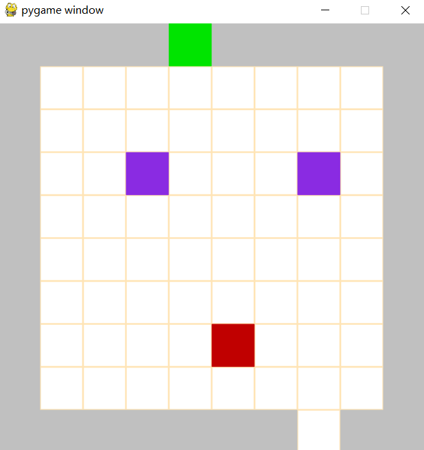
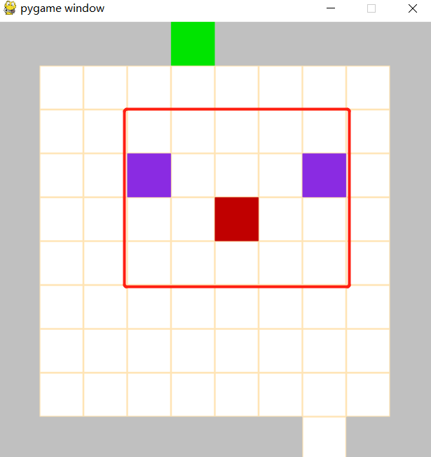
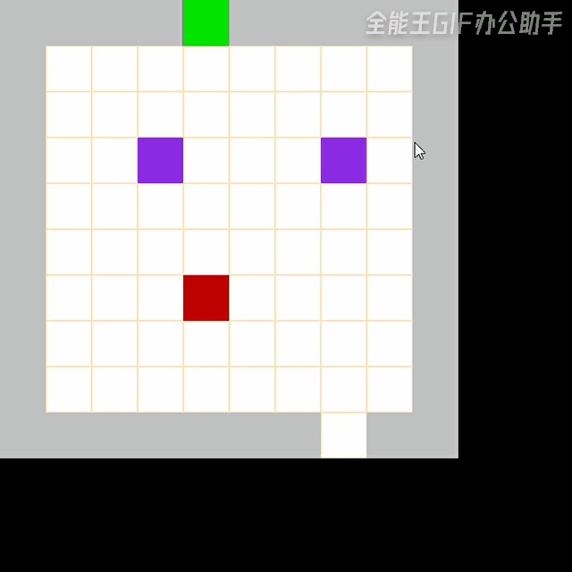
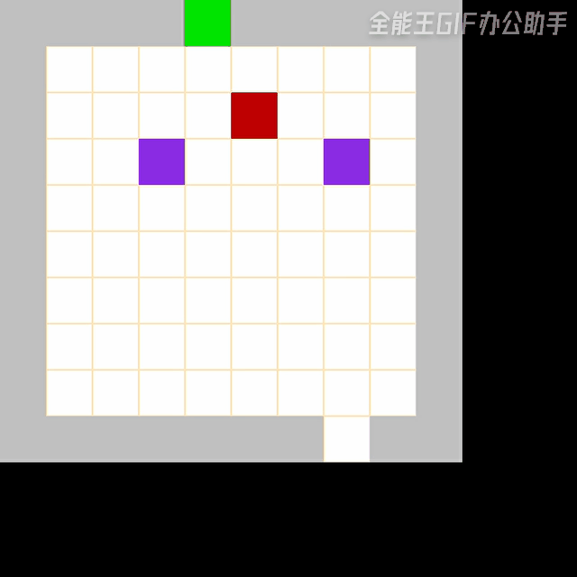

RL_shoot_game 强化学习射击小游戏
--

使用强化学习训练射击类通关小游戏AI  
  
### 关于项目文件  
**1-Q_learning**     
该文件下存放基于Q_learning算法的通关项目
* game.py 里面定义游戏界面  
* q_learning.py Qlearning算法核心  
* main.py 主函数， 负责游戏情节迭代  

  
**2-DQN**       
该文件下存放基于DQN算法的通关项目
* game.py 里面定义游戏界面
* DQN.py DQN算法核心
* main.py 主函数， 负责游戏情节迭代
* Net.py 神经网络(pytorch)
* model 存放训练模型，笔者已训练100个episode
    

## 游戏介绍   

### 游戏界面  
  
绿色代表终点，紫色代表怪兽， 灰色代表围墙，红色代表玩家  

### 如何攻击  
角色有效攻击范围如图中红色部分所示, 当怪兽位于攻击范围内时,玩家必须**静止2s**,才能完成怪物的击杀  

  

### 如何通关    
必须消灭所有怪物后才能通关， 否则只是相当于移动到终点  

### 效果展示  
1. q_learning        
   
  
2. DQN    
   

### 开始游戏  
```
python main.py
```   

###  时间线
- [x] 完成界面搭建        21-07-23   
- [x] 完成Q-learning算法 21-08-01  
- [x] 完成DQN算法        21-08-12  
- [ ] 添加更多强化学习算法   
 